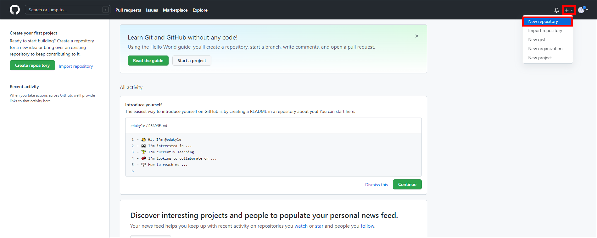
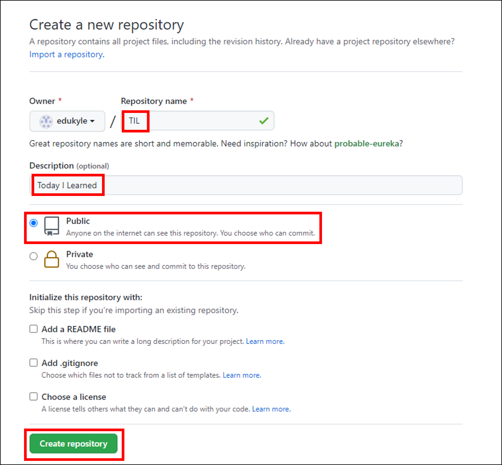
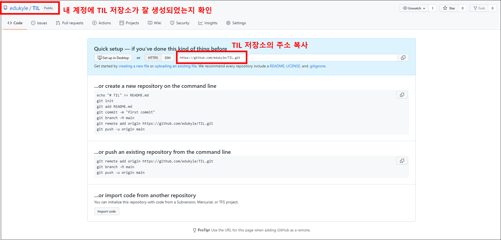

# Git 

## 1. Git 초기 설정
----
>최초 한번만 설정.
### 1) 이름, 메일주소 설정
```bash
$ git config --global user.name "GitHub Username"
$ git config --global user.email "GitHub Emailaddress"
```
### 2) 설정 확인하기
```bash
$ git config --global -l
또는
$ git config --globall - list
```

## 2. Git 기본 명령어
----
- `Working Directory (= Working Tree)` : 사용자의 일반적인 작업이 일어나는 곳.
- `Staging Area (= Index)` : 커밋을 위한 파일 및 폴더가 추가되는 곳.
- `Repository` : staging area에 있던 파일 및 폴더의 변경사항(커밋)을 저장하는 곳.
- Git은 **Working Directory -> Staging Area -> Repository** 의 과정으로 버전 관리를 수행한다.
### 1) git init
```bash
$ git init
Initialized empty Git repository in C:/Users/kyle/git-practice/.git/

kyle@KYLE MINGW64 ~/git-practice (master)
```
- 현재 작업 중인 디렉토리를 Git으로 관리한다는 명령어
- `.git` 이라는 숨김 폴더를 생성하고, 터미널에는 `(master)` 라고 표기된다.
- Mac OS의 경우 `(master)`가 표기되지 않는데, Terminal 업그레이드를 통해 표기할 수 있다.
```
! 주의사항
    1. 이미 Git 저장소인 폴더 내에 또 다른 Git 저장소를 만들지 않는다.(중첩 금지)
    즉, 터미널에 이미(master)가 있다면, git init을 절대 입력하면 안된다.
    
    2. 절대로 홈 디렉토리에서 git init을 하지 않는다. 터미널의 경로가 ~ 인지 확인한다. 
```
### 2) git status
```bash
$ git status
On branch master

No commits yet

nothing to commit (create/copy files and use "git add" to track)
```
- Working Directory와 Staging Area에 있는 파일의 현재 상태를 알려주는 명령어
- 어떤 작업을 시행하기 전에 수시로 status를 확인하면 좋다.
- 상태
  
  1. `Untracked` : Git이 관리하지 않는 파일 (한번도 Staging Area에 올라간 적 없는 파일)
  2. `Tracked` : Git이 관리하는 파일

        a. `Unmodified` : 최신상태
        
        b. `Modified` : 수정되었지만 아직 Staging Area에는 반영하지 않은 상태

        c. `Staged` : Staging Area에 올라간 상태

### 3) git add
```bash
# 특정 파일
$ git add a.txt

# 특정 폴더
$ git add my_folder/

# 현재 디렉토리에 속한 파일/폴더 전부
$ git add .
```
- Working Directory에 있는 파일을 Staging Area로 올리는 명령어
- Git이 해당 파일을 추적(관리)할 수 있도록 만든다.
- `Untracked, Modified → Staged` 로 상태를 변경합니다.

### 4) git commit
```bash
$ git commit -m "first commit"
[master (root-commit) c02659f] first commit
 1 file changed, 0 insertions(+), 0 deletions(-)
 create mode 100644 a.txt
```
- Staging Area에 올라온 파일의 변경 사항을 하나의 버전(커밋)으로 저장하는 명령어
- `커밋 메세지` 는 현재 변경 사항들을 잘 나타낼 수 있도록 `의미` 있게 작성해야 한다.
- 각각의 커밋은 `SHA-1` 알고리즘에 의해 반환 된 고유의 해시 값을 ID로 가진다.
- `(root-commit)` 은 해당 커밋이 최초의 커밋 일 때만 표시된다. 이후 커밋부터는 사라진다.

### 5) git log
```bash
$ git log
commit 1870222981b4731d14ef91d401c68c0bbb2f6e7d (HEAD -> master)
Author: kyle <kyle123@hphk.kr>
Date:   Thu Dec 9 15:26:46 2021 +0900

    first commit
```
- 커밋의 내역`(ID, 작성자, 시간, 메세지 등)`을 조회할 수 있는 명령어
- 옵션
  - `--oneline` : 한 줄로 축약해서 보여준다.
  - `--graph` : 브랜치와 머지 내역을 그래프로 보여준다.
  - `--all` : 현재 브랜치를 포함한 모든 브랜치의 내역을 보여준다.
  - `--reverse` : 커밋 내역의 순서를 반대로 보여준다. (최신이 가장 아래)
  - `-p` : 파일의 변경 내용도 같이 보여준다.
  - `-2` : 원하는 갯수 만큼의 내역을 보여준다. (2 말고 임의의 숫자 사용 가능)


# Github
## 1. 원격 저장소 (Remote Repository)
----
>여태 까지는 내 컴퓨터라는 한정된 공간에 있는 로컬 저장소에서만 버전 관리를 진행했다.
이제는 Github의 원격 저장소를 이용해 내 컴퓨터의 로컬 저장소를 다른 사람과 공유할 수 있다.
Git의 주요 목적 중 하나인 협업을 위해 로컬 저장소와 원격 저장소의 연동 방법을 학습한다.
### 1) Github에서 원격 저장소 생성

화면 오른쪽 상단 더하기(+) 버튼을 누르고 New repository를 클릭.



저장소의 이름, 설명, 공개 여부를 선택하고 Create repository를 클릭한다. (체크 박스는 건드리지 않는다.)
### 2) 로컬 저장소와 원격 저장소 연결
1. 원격 저장소가 잘 생성되었는지 확인 후, 저장소의 주소를 복사한다.
   
2. 기존에 실습 때 만들었던 홈 디렉토리의 TIL 폴더로 가서 vscode를 연다.
3. git init을 통해 TIL 폴더를 로컬 저장소로 만들어줍니다.
   ```bash
   $ git init
    Initialized empty Git repository in C:/Users/kyle/TIL/.git/
   ```
4. `git remote`
   
    로컬 저장소에 원격 저장소를 `등록, 조회, 삭제` 할 수 있는 명령어
    1. 등록
        ```bash
        $ git remote add origin https://github.com/leeyonghee90/TIL.git

        [풀이]
        git 명령어를 작성할건데, remote(원격 저장소)에 add(추가) 한다.
        origin이라는 이름으로 https://github.com/leeyonghee90/TIL.git라는 주소의 원격 저장소를
        ```
    2. 조회

        `git remote -v` 로 작성한다.
        ```bash
        $ git remote -v
        origin  https://github.com/leeyonghee90/TIL.git (fetch)
        origin  https://github.com/leeyonghee90/TIL.git (push)


        add를 이용해 추가했던 원격 저장소의 이름과 주소가 출력된다.
        ```
    3. 삭제

        `git remote rm <이름>` 혹은 `git remote remove <이름>` 으로 작성합니다.
        >로컬과 원격 저장소의 연결을 끊는 것이지, 원격 저장소 자체를 삭제하는게 아니다.
        ```bash
        $ git remote rm origin
        $ git remote remove origin


        [풀이]
        git 명령어를 작성할건데, remote(원격 저장소)와의 연결을 rm(remove, 삭제) 한다.
        그 원격 저장소의 이름은 origin이다.
        ```

## 3) 원격 저장소에 업로드
- 먼저 로컬 저장소에서 커밋을 생성해야 원격 저장소에 업로드 할 수 있다.

### 1. 로컬 저장소에서 커밋 생성
```bash
# 현재 상태 확인

    $ git status
    On branch master

    No commits yet

    Untracked files:
    (use "git add <file>..." to include in what will be committed)
        day1.md

    nothing added to commit but untracked files present (use "git add" to track)
```
```bash
$ git add day1.md
```
```bash
$ git commit -m "Upload TIL Day1"
[master (root-commit) f3d6d42] Upload TIL Day1
 1 file changed, 0 insertions(+), 0 deletions(-)
 create mode 100644 day1.md
```
```bash
# 커밋 확인

$ git log --oneline
f3d6d42 (HEAD -> master) Upload TIL Day1
```

### 2. git push
- 로컬 저장소의 커밋을 원격 저장소에 업로드하는 명령어
- `git push <저장소 이름> <브랜치 이름>` 형식으로 작성한다.
- `-u` 옵션을 사용하면, 두 번째 커밋부터는 `저장소 이름, 브랜치 이름` 의 생략이 가능하다.
  ```bash
  $ git push origin master

    [풀이]
    git 명령어를 사용할건데, origin이라는 이름의 원격 저장소의 master 브랜치에 push 한다.

    ------------------------------------------------

 
    이후에는 $ git push 라고만 작성해도 push가 된다.
  ```
### 3. 자격증명
- `Sig in with your browser -> Authorize` 로 vscode 자격증명. 
- 이후 git push 완료
    ```bash
    $ git push -u origin master
    info: please complete authentication in your browser...
    Enumerating objects: 3, done.
    Counting objects: 100% (3/3), done.
    Writing objects: 100% (3/3), 218 bytes | 218.00 KiB/s, done.
    Total 3 (delta 0), reused 0 (delta 0), pack-reused 0
    To https://github.com/edukyle/TIL.git
    * [new branch]      master -> master
    Branch 'master' set up to track remote branch 'master' from 'origin'.
    ```

### 4. 원격 저장소에서 정상 업로드 확인